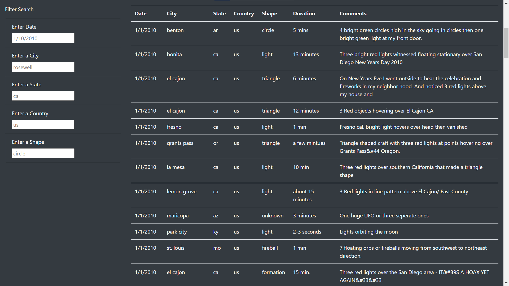
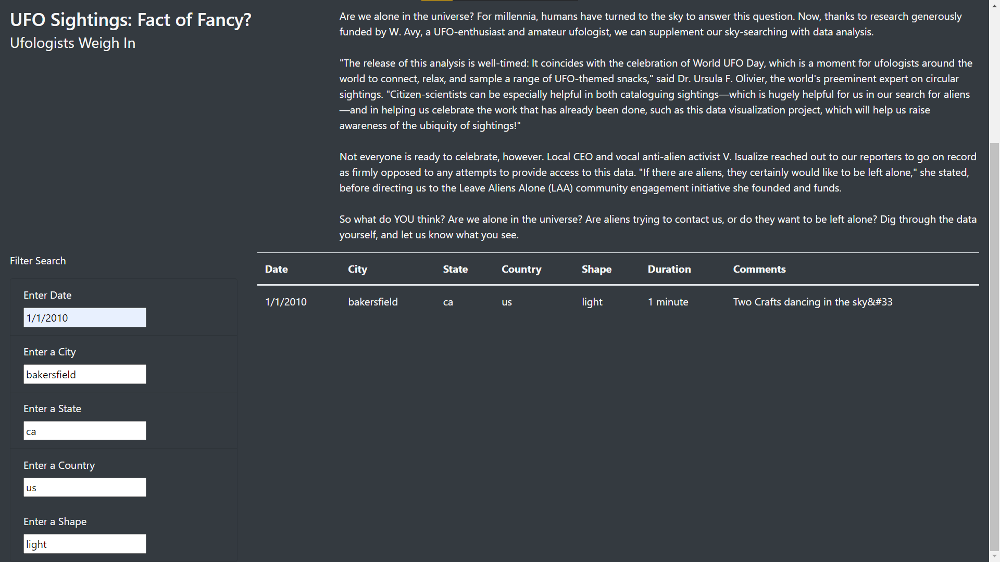

# UFO_sightings

## Overview:

We are creating a website to display UFO sighting data file and using a JS app to filter the data.

### Resources:

UFO Data was provided in:
- [data.js](static/js/data.js)

Additional Resources: 
- Bootstrap 4.0.0
- JavaScript 
- HTML

Additional Documentation:
- [Bootstrap](https://getbootstrap.com/docs/4.0/getting-started/introduction/)
- [JavaScritWebDocs](https://developer.mozilla.org/en-US/docs/Web/JavaScript)

## Results

### The following script creates an unfiltered table on our page:

    // from data.js
    const tableData = data;

    // get table references
    var tbody = d3.select("tbody");

    function buildTable(data) {
      // First, clear out any existing data
      tbody.html("");

      // Next, loop through each object in the data
      // and append a row and cells for each value in the row
      data.forEach((dataRow) => {
        // Append a row to the table body
        let row = tbody.append("tr");

        // Loop through each field in the dataRow and add
        // each value as a table cell (td)
        Object.values(dataRow).forEach((val) => {
          let cell = row.append("td");
          cell.text(val);
        });
      });
    }
    
### The filter script created input boxes that filtered data whenever a user inputs data:

    // 1. Create a variable to keep track of all the filters as an object.
    let filters = {}; 

    // 3. Use this function to update the filters. 
    function updateFilters() {

        // 4a. Save the element that was changed as a variable.
        let changedElement = d3.select(this);
        // 4b. Save the value that was changed as a variable.
        let elementValue = changedElement.property("value");
        console.log(elementValue);
        // 4c. Save the id of the filter that was changed as a variable.
        let filterId = changedElement.attr("id")
        console.log(filterId);

        // 5. If a filter value was entered then add that filterId and value
        // to the filters list. Otherwise, clear that filter from the filters object.
        if (elementValue) {
          filters[filterId] = elementValue;
        }
        else {
          delete filters[filterId]
        }

        // 6. Call function to apply all filters and rebuild the table
        filterTable(filters);

      }

      // 7. Use this function to filter the table when data is entered.
      function filterTable() {

        // 8. Set the filtered data to the tableData.
        let filteredData = tableData  

        // 9. Loop through all of the filters and keep any data that
        // matches the filter values
        Object.entries(filters).forEach(
          ([key,value]) => {
            filteredData = filteredData.filter(row => row[key] === value)
          }
        );
        // 10. Finally, rebuild the table using the filtered data
        buildTable(filteredData);
      } 

      // 2. Attach an event to listen for changes to each filter
      d3.selectAll("input").on("change", updateFilters);

      // Build the table when the page loads
      buildTable(tableData);

#### How it works:

Users are presented with an unfiltered table upon loading the page, with place holders in the input boxes as format examples:

The table is then filtered after user inputs a value for any of the input boxes:

> #### Here is a list of filter options:
> 
> **Date **
> 01/01/2010 - 01/13/2010 
> 
> **Cities**
> - "bonita"
> - "el cajon"
> - "fresno"
> - "grants pass"
> - "la mesa"
>
> **State**
> - "ca"
> - "pa"
> - "az"
> - "fl"
> 
> **Country**
> - "us"
> - "ca"
> 
> **Shape**
> - "light"
> - "triangle"
> - "unknown"

## Summary

One of the biggest drawbacks to this webpage is that it is very limited to one's understanding of the data supplied. While someone could look into the data.js file for a reference of possible filters, it isn't intuative. Furthermore, larger datasets would make this method impractical. We could add a list that contains unique elemnts for each filter category, but that also means that for larger data sets, we would get really large lists. A drop-down menu that lists all possible options for each filter could be much more intuative for individuals not familiar with the dataset.
